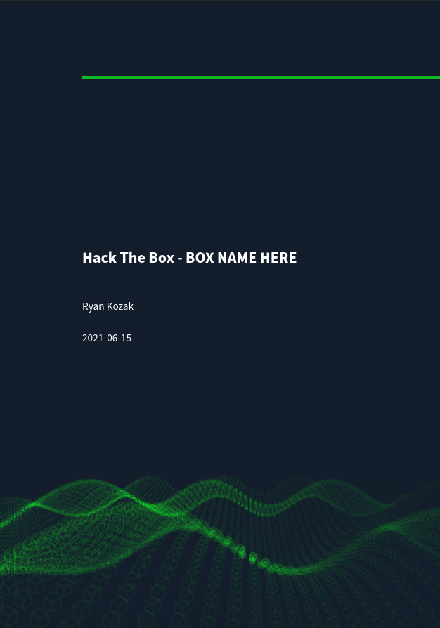

# Hack The Box CTF Writeup Template
This repository contains a template/example for my [Hack The Box](https://hackthebox.eu) writeups. Below you'll find some information on the required tools and general work flow for generating the writeups. I also write about it on my blog [here](https://ryankozak.com/how-i-do-my-ctf-writeups/), which has some details about also posting the markdown on Jekyll.

[](./pdf/HTB_Writeup-TEMPLATE-d0n601.pdf)

## Installation on Arch Linux
1. Install [Latex](https://www.latex-project.org/) and support packages for Latex via `sudo pacman -S texlive-most`.
2. Install [Pandoc](https://pandoc.org/) via `sudo pacman -S pandoc bcprov java-commons-lang `.
3. Install [PDFtk](https://www.pdflabs.com/tools/pdftk-the-pdf-toolkit/) via `sudo pacman -S pdftk`.
4. Install the [Pandoc Latex Template](https://github.com/Wandmalfarbe/pandoc-latex-template)
   * Download the latest version of the Eisvogel template from the [release page](https://github.com/Wandmalfarbe/pandoc-latex-template/releases/latest).
   * Extract the `tar.gz` archive and open the folder.
   * Create a pandoc templates folder if it doesn't exist at `~/.pandoc/templates/`.
   * Move the template `eisvogel.tex` to your pandoc templates folder and rename the file to `eisvogel.latex`.


## Installation on Ubuntu 18.04 LTS
*Note: If you use Debian or Mint it may work but your mileage here might vary.*

1. Install [Latex](https://www.latex-project.org/) via `sudo apt-get install texlive`.
2. Install extra support packages for Latex  `sudo apt install texlive-xetex`.
3. Install extended fonts for Latex `sudo apt-get install texlive-fonts-recommended texlive-fonts-extra`.
4. Install [Pandoc](https://pandoc.org/) via `sudo apt-get install pandoc`.
5. Install the [Pandoc Latex Template](https://github.com/Wandmalfarbe/pandoc-latex-template)
   * Download the latest version of the Eisvogel template from the [release page](https://github.com/Wandmalfarbe/pandoc-latex-template/releases/latest).
   * Extract the `tar.gz` archive and open the folder.
   * Create a pandoc templates folder if it doesn't exist at `~/.pandoc/templates/`.
   * Move the template `eisvogel.tex` to your pandoc templates folder and rename the file to `eisvogel.latex`.
6. Make sure you have [PDFtk](https://www.pdflabs.com/tools/pdftk-the-pdf-toolkit/) installed via `sudo snap install pdftk`.


## Usage
Initially I publish my writeups as a password protected pdf, the password set to the root flag for the box. After the box is retired, I post the writeup on my Jekyll site.

Here's the directory structure for my writeup [template](https://github.com/d0n601/HTB_Writeup-Template).

```
HTB_Writeup-TEMPLATE
│   HTB_Writeup-TEMPLATE-d0n601.md   
│
└───pdf
│   │   HTB_Writeup-TEMPLATE-d0n601.pdf
│   │
│   └───protected
│       │   HTB_Writeup-TEMPLATE-d0n601.pdf
│   
└───images
│       │   bg.pdf
│       │   someotherimage.png
│       │   ...
```

### Markdown for pdf
In order to generate a pdf from markdown using pandoc we must format the header correctly. The header for my template is as follows.

```
---
title: "Hack The Box - BOX NAME HERE"
author: Ryan Kozak
date: "2021-06-15"
subject: "CTF Writeup Template"
keywords: [HTB, CTF, Hack The Box, Security]
lang: "en"
titlepage: true
title-page-color: "141d2b"
titlepage-rule-color: "11b925"
titlepage-text-color: "FFFFFF"
toc: true
toc-own-page: true
titlepage-background: "./images/bg.pdf"
...
```

Once the writeup is complete, or you're just looking to build it to see how it's looking as a pdf, issue the following command from your writeup directory.
#### Arch Linux
`pandoc --pdf-engine=xelatex ./HTB_Writeup-TEMPLATE-d0n601.md -o ./pdf/HTB_Writeup-TEMPLATE-d0n601.pdf --from markdown --template eisvogel --listings`  

#### Ubuntu 18.04
`pandoc --latex-engine=xelatex ./HTB_Writeup-TEMPLATE-d0n601.md -o ./pdf/HTB_Writeup-TEMPLATE-d0n601.pdf --from markdown --template eisvogel --listings`


### Password Protect pdf
**Update:** Now, HTB has **dyamic flags**, so while this is a nice tutorial on how to password protect a PDF, it doesn't really make sense any more to use your root flag as the password. No one else will have the same root flag as you, so only you'll know how to get in. Some folks are using things like the `/etc/shadow` file's root hash.

To password protect the pdf I use `pdftk`. From the root folder of the writup directory issue the following command.

`pdftk ./pdf/HTB_Writeup-TEMPLATE-d0n601.pdf output ./pdf/protected/HTB_Writeup-TEMPLATE-d0n601.pdf user_pw v5gw5zkh8rr3vmye7p4ka`

Now a password protected pdf will appear in the `/pdf/protected` directory.
